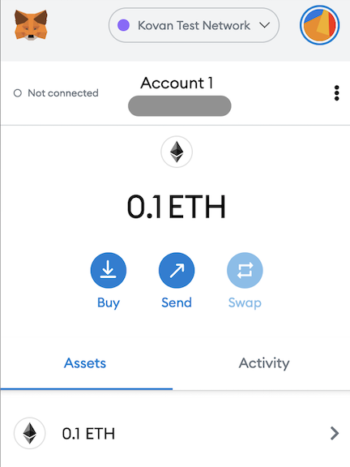

# link_aave_brownie

### Chainlink [tutorial](https://blog.chain.link/blockchain-fintech-defi-tutorial-lending-borrowing-python/) by Patrick Collins to learn some DeFi basics with Python.


## Intro

Put down collateral, borrow, and repay a loan from Aave! Use this to short assets and accrue interest. 

[You can see a web3 version of this here](https://github.com/PatrickAlphaC/aave_web3_py)

In our `aave_borrow.py` script, we do the following:

1. Approve our `ETH` to be swapped for `WETH`
2. Swap an `amount` of `ETH` for `WETH`
3. Using `deposit_to_aave` we deposit the `WETH` as collateral
4. We use that collateral to borrow `LINK` with `borrow_erc20`
5. Then, we pay it back! 
6. We can view the txs on etherscan to see what's going on under the hood. 


## Setup
1. Setup python and virtual env and then install requirements.
```
pip install -r requirements.txt
```
The Brownie [project structure](https://eth-brownie.readthedocs.io/en/stable/structure.html#structure) folders will be added.

2. Create a [MetaMask wallet](https://metamask.io/). Use the iOS app or the browser extension. Retrieve the MetaMask account private key and save to the `PRIVATE_KEY` variable in the .env_var file like
```
export PRIVATE_KEY=0x34723rbjnf847620lqmjds70wi3wc9plwschu4646qojqlkngf4r78pjnhvsd
```
Note that `0x` is added to the start of the private key

3. Create an [Infura](https://infura.io) project. Retrieve the Infura project ID and save to the `WEB3_INFURA_PROJECT_ID` variable in the .env_var file like
```
export WEB3_INFURA_PROJECT_ID=lknef8023nwdbd8wpkwpmdkn48349qwe
```


4. Add your environmental variables with `source .env_var`

5. Get Kovan testnet ETH from the [Chainlink faucet](https://docs.chain.link/docs/link-token-contracts/) and add it to your MetaMask wallet.

Add MetaMask wallet address in the Chainlink faucet form and get test ETH. Processing could require several minutes. Get a coffee ;)


Test ETH added to MetaMask wallet




## Convert ETH to wETH

ETH pre-dates and does not conform to the ERC-20 standard. So we need to exchange some of the ETH for wrapped ETH (wETH), which can be traded in smart contracts running on Ethereum. Dapps running on Ethereum trade in tokens using the same standard. "Wrapping" ETH actually means trading ETH for wETH
```
brownie run scripts/get_weth.py --network kovan
```
The script prints out details like your wallet address, account balance and gas paid. Amounts are in Wei, which is a subdivision of ETH. 1 ETH = 1,000,000,000,000,000,000 Wei.

Brownie shows the transaction info 


## Borrow then repay

Retrieve the address for the Kovan testnet Aave lending pool address provider. Then use it to retrieve the address of Aave lending protocol contract. The address provider is used because the main Aave lending pool contract address changes.

The lending pool contract is the main contract of the Aave protocol. It exposes user actions like deposit, withdraw, borrow, repay, etc.
```
brownie run scripts/aave_borrow.py --network kovan
```
Then check if the wETH is ERC20 compliant. This check is also a transaction on the blockchain. The transaction waits in the mempool (memory pool) until a miner picks up the transaction to include it in the next block. Paying higher fees encourages miners to select your transaction.

Each block mined on top of the block containing my transaction is a confirmation. Confirmations give confidence in the validity of a transaction. Large transactions requires more confirmations.


Then deposit some wETH into Aave as collateral for the subsequent loan. When depositing the wETH, Aave sends my wallet aToken. This aToken, which is aWETH in this case, is an interest-bearing token that is minted on deposit. Whenever its time to withdraw the deposited wETH, the equivalent amount of aWETH is burnt.


Add the aWETH to Metamask using the Kovan testnet aWETH address `0x87b1f4cf9bd63f7bbd3ee1ad04e8f52540349347`.

Retrieve the borrower loan data, including the health factor and the amounts deposited, borrowed and available to borrow. The retrieval of this info does not require a smart contract nor a gas fee because it is only a view transaction.

Using a Chainlink data feed, get the current price of ETH in DAI. DAI is a stablecoin  running on Ethereum that tries to maintain a value of $1.00 USD