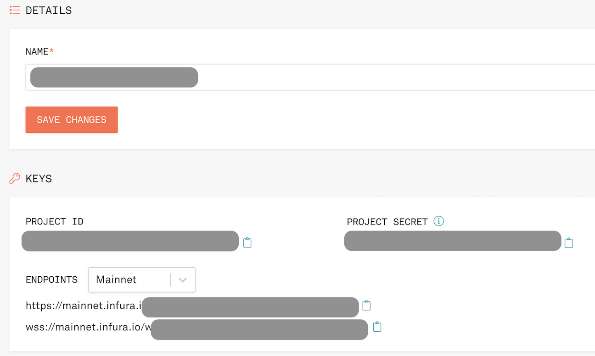

# link_aave_brownie

### Chainlink [tutorial](https://blog.chain.link/blockchain-fintech-defi-tutorial-lending-borrowing-python/) by Patrick Collins to learn some DeFi basics with Python.


## Intro

Put down collateral, borrow, and repay a loan from Aave! Use this to short assets and accrue interest. 

[You can see a web3 version of this here](https://github.com/PatrickAlphaC/aave_web3_py)

In our `aave_borrow.py` script, we do the following:

1. Approve our `ETH` to be swapped for `WETH`
2. Swap an `amount` of `ETH` for `WETH`
3. Using `deposit_to_aave` we deposit the `WETH` as collateral
4. We use that collateral to borrow `LINK` with `borrow_erc20`
5. Then, we pay it back! 
6. We can view the txs on etherscan to see what's going on under the hood. 


## Setup
1. Setup python and virtual env and then install requirements.
```
pip install -r requirements.txt
```
The Brownie [project structure](https://eth-brownie.readthedocs.io/en/stable/structure.html#structure) folders will be added.

2. Create a [MetaMask wallet](https://metamask.io/). Use the iOS app or the browser extension. Retrieve the MetaMask account private key and save to the `PRIVATE_KEY` variable in the .env_var file like
```
export PRIVATE_KEY=0x34723rbjnf847620lqmjds70wi3wc9plwschu4646qojqlkngf4r78pjnhvsd
```
Note that `0x` is added to the start of the private key

3. Create an [Infura](https://infura.io) project. Retrieve the Infura project ID and save to the `WEB3_INFURA_PROJECT_ID` variable in the .env_var file like
```
export WEB3_INFURA_PROJECT_ID=lknef8023nwdbd8wpkwpmdkn48349qwe
```


4. Add your environmental variables with `source .env_var`

5. Get Kovan testnet ETH from the [Chainlink faucet](https://docs.chain.link/docs/link-token-contracts/) and add it to your MetaMask wallet.

Add MetaMask wallet address in the Chainlink faucet form and get test ETH. Processing could require several minutes. Get a coffee ;)


Test ETH added to MetaMask wallet


## Run scripts

ETH pre-dates and does not conform to the ERC-20 standard. So we need to exchange some of the ETH for wrapped ETH (wETH), which can be traded in smart contracts running on Ethereum. Dapps running on Ethereum trade in tokens using the same standard. "Wrapping" ETH actually means trading ETH for wETH
```
brownie run scripts/get_weth.py --network kovan
```
The script prints out details like your wallet address, account balance and gas paid. Amounts are in Wei, which is a subdivision of ETH. 1 ETH = 1,000,000,000,000,000,000 Wei.

Brownie shows the transaction info 


# Quickstart - mainnet-fork
Optional for running locally:
If you want to run locally, you can install `ganache-cli` and `yarn`. Here is where you can [install yarn.](https://classic.yarnpkg.com/en/docs/install/#mac-stable)

```
yarn global add ganache-cli
```

Then, you can run `ganache-cli --fork YOUR_INFURA_URL_HERE`, or just `brownie run <YOUR_SCRIPT> --network mainnet-fork`

1. Get some WETH, borrow, and repay!

```
brownie run scripts/aave_borrow.py
```
